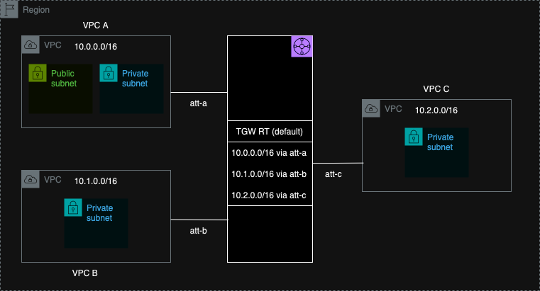

# Transit Gateway

A [Transit Gateway](https://docs.aws.amazon.com/vpc/latest/tgw/what-is-transit-gateway.html) is a service in Amazon Web Services (AWS) that simplifies the connectivity between multiple VPCs (Virtual Private Clouds) and on-premises networks. It acts as a central hub, allowing you to connect multiple VPCs and VPN connections, as well as route traffic between them.

Here's why you might need to work with VPCs in conjunction with Transit Gateway:

`Scalability`: As your AWS infrastructure grows, you might have multiple VPCs spread across different regions or accounts. Managing direct connections between each of these VPCs can become complex. Transit Gateway simplifies this by providing a centralized point for connectivity.

`Simplified Network Architecture`: Rather than setting up and managing point-to-point connections between every pair of VPCs, Transit Gateway allows you to connect all your VPCs to a single gateway. This reduces the complexity of your network architecture.

`Cost Efficiency`: Transit Gateway can help reduce data transfer costs by centralizing traffic flows. Instead of paying for data transfer between every pair of VPCs, you only pay for data transfer to and from the Transit Gateway.

`Security`: Transit Gateway allows you to enforce security policies and routing rules centrally. This makes it easier to manage and maintain consistent security configurations across your VPCs.

`Integration with On-Premises Networks`: Transit Gateway can also be used to connect your AWS infrastructure to on-premises data centers or offices via VPN or Direct Connect connections. This allows for seamless integration between your cloud and on-premises environments.

## Lab Steps
1 - Create 3 VPCs and corresponding private subnets. For VPC A - additionally create a `Public Subnet` (We need that for jump host).

2 - Create Transit Gateway.

3 - Create 3 VPC attachments for the `Transit Gateway`.

4 - Modify all Private subnet route table and add route for `10.0.0.0/8` via the Transit Gateway attachment.

5 - `SSH` to `VPC A` jump host -> `SSH` to `EC2-A` -> Ping to `EC2-B` or `EC2-C` using a Private IP.

## Diagram
